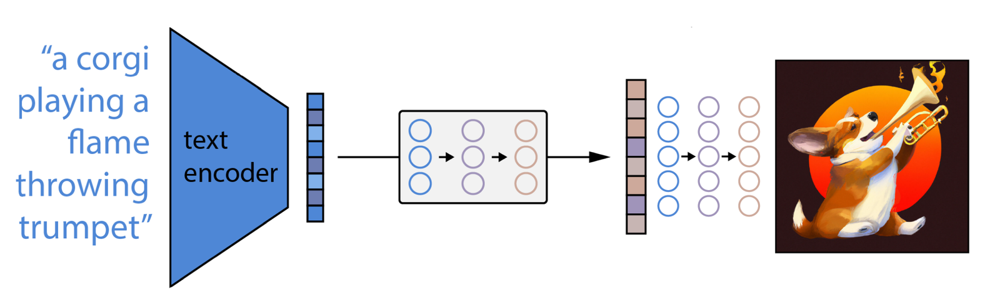

name: inverse
layout: true
class: center, middle, inverse
---

#### Impulsvortrag 
  
# *Künstliche Intelligenz*

### Björn Stockleben & Lena Gieseke

#### 30.06.2023 | Professorium

???
.task[COMMENT:]  

Björn und ich möchten einen kurzen Impuls zu Thema KI geben, und zwar...

---
layout:false

## Agenda

* Begriffsklärung & Grundlagen 

???
.task[COMMENT:]  

...werde ich auf Begrifflichkeiten und ein paar Grundlagen eingehen
--
* Anwendungsbeispiele
    * ChatGPT
    * Bildgenerierung

???
.task[COMMENT:]  

... und zwei Beispiele geben, mit dem Ziel ein intuitives Verständnis jenseits des Hypes zu vermitteln.

Björn wirft dann einen genaueren Blick auf...

-----------

Storyline: Intuitives Verständnis jenseits des Hypes
Take home message: KI ist kein Hexenwerk, mit einer überlegten Herangehensweise und bestimmten Regulierungen stellt es einen großen Mehrwert dar.

--

### *KI in der Filmproduktion* von Björn

---
layout: false

## Künstliche Intelligenz

.center[]

.footnote[[[Bild: promatis]](https://www.promatis.de/2019/01/18/digitale-transformation-oder-digitale-evolution/)]

???
.task[COMMENT:]  

Also, stehen Roboter und Algorithmen kurz davor die besseren Menschen zu werden?

Die tatsächlich aktuell verfügbaren Möglichkeiten...

---
template:inverse

# Begriffsklärung & Grundlagen

???
.task[COMMENT:]  

... fallen unter den Begriff der

---
.header[Begriffsklärung & Grundlagen]

## Schwache KI

???
.task[COMMENT:]  

schwachen KI, was bedeutet, dass...

...bestimmte Aufgaben....

---
.header[Begriffsklärung & Grundlagen]

## Schwache KI

* Wahrnehmen
* Kommunizieren
* Planen
* Schlussfolgern
* Lernen

???
.task[COMMENT:]  

typisch menschlicher Kernfähigkeiten genauso gut oder besser als von Menschen erledigt werden.

Aktuell stehen hier...

---
.header[Begriffsklärung & Grundlagen]

## Schwache KI

* Wahrnehmen
* Kommunizieren
* Planen
* Schlussfolgern
* **Lernen**

???
.task[COMMENT:]  

vor allem durch Daten selbstlernende Systeme im Fokus.

Lernen kann man als...  

--

> Lernen ist ein Prozess, durch den ein System die eigene Leistung auf Grund von Erfahrungen verbessert. - Herbert Simon

???
.task[COMMENT:]  

...einen Prozess beschreiben, durch den ein System die eigene Leistung auf Grund von Erfahrungen bzw. Daten verbessert.

Als Veranschaulichung was das für einen Algorithmus bzw. ein System bedeutet, hier ein kurzes Beispiel...

*Optinal*
* Herbert Alexander Simon (June 15, 1916 – February 9, 2001) was an American economist, political scientist and cognitive psychologist, whose primary research interest was decision-making within organizations and is best known for the theories of "bounded rationality" and "satisficing".[5] He received the Nobel Prize in Economics in 1978 and the Turing Award in 1975.
* Intelligence: reason, learn, plan, solve problems

---
.header[Begriffsklärung & Grundlagen | Schwache KI]

## Anweisungen vs. Lernen

???
.task[COMMENT:]  

dass einen klassischen Anweisunggesteuerten Algorithmus mit einem lernenden vergleicht.

--

.center[]

???
.task[COMMENT:]  

Als Beispiel haben wir folgendes Szenario: eine Fläche mit einer Breite von links nach rechts, mit links beginnend bei null bis zur rechten Seite mit dem Wert 100. Die Fläche soll nun in rechts und links unterteilt werden und ein Algorithmus soll für einen gegebenen Wert,

---
.header[Begriffsklärung & Grundlagen | Schwache KI]

## Anweisungen vs. Lernen

.center[]

???
.task[COMMENT:]  

wie hier zum Beispiel den Wert 80, entscheiden, ob dieser Wert auf der linken Seite oder rechten Seite liegt.

Also, klassische Anweisungen könnten wie folgt aussehen

---
.header[Begriffsklärung & Grundlagen | Schwache KI]

## Anweisungen vs. Lernen

.center[]

???
.task[COMMENT:]  

Falls der Wert für den wir entscheiden wollen auf welcher Seite er liegt, größer als 50 ist, dann liegt er auf der rechten Seite. Bei allen anderen Werten, also allen kleiner gleich 50, liegt der Wert auf der linken Seite.

Und hiermit habe sie auch gleich ein bisschen Programmieren gelernt.

---
.header[Begriffsklärung & Grundlagen | Schwache KI]

## Anweisungen vs. Lernen

.center[]

???
.task[COMMENT:]  

Setzen wir nun den Wert 80 ein, sehen wir, dass 80 größer als 50 ist, wir somit in den Teil springen der besagt dass wir auf den Wert als auf der rechten Seite liegend bestimmen können.

Nun stellen wir uns die gleich Aufgabe vor, aber mit folgendem Szenario,

---
.header[Begriffsklärung & Grundlagen | Schwache KI]

## Anweisungen vs. Lernen

.center[]

???
.task[COMMENT:]  

wir wissen eigentlich nichts über den Raum, also hier Wertebereiche, haben eine Reihe an Beispielen, 

---
.header[Begriffsklärung & Grundlagen | Schwache KI]

## Anweisungen vs. Lernen

.center[]

???
.task[COMMENT:]  

von denen wir wissen, ob sie links oder rechts liegen und

---
.header[Begriffsklärung & Grundlagen | Schwache KI]

## Anweisungen vs. Lernen

.center[]

---
.header[Begriffsklärung & Grundlagen | Schwache KI]

## Anweisungen vs. Lernen

.center[]

???
.task[COMMENT:]  

bekommen wir nun einen neuen Wert rein entscheiden wir für diesen anhand der vorhandenen Daten, ob wir ihn als links oder rechts einstufen. 

---
.header[Begriffsklärung & Grundlagen | Schwache KI]

## Anweisungen vs. Lernen

.center[]

???
.task[COMMENT:]  
Und genau das ist Maschinelles Lernen

---------------

In der klassischen Programmierung geben wir Anweisungen und Daten im Vorfeld vor und berechnen dann anhand dieser Anweisungen das Ergebnis.

Beim maschinellen Lernen starten wir mit einer Reihe an möglichen Ergebnissen und versuchen anhand dieser Daten ein Programm zu erzeugen, dass uns für neue Daten die gleichen Ergebnisse liefert.

---
.header[Begriffsklärung & Grundlagen | Schwache KI]

## Anweisungen vs. Lernen

.center[]

Wir brauchen sehr viele Daten!

???
.task[COMMENT:]  

Wir brauchen sehr viele Daten um in einen unbekannten Raum mit unbekannte Objekten, die Eigenschaften dieser Objekte zu lernen. 

Und genau deswegen, sind diese Algorithmen erst relativ kürzliche so mächtig geworden. Nämlich seitdem immer mehr Daten und Rechenleistung zur für das Trainieren zur Verfügung stehen.

Eine der größten Probleme bei diesen Verfahren ist es, dass sie sogenannte Black Boxes sind. Was bedeutet das bzw. warum ist das so?

Wie schon gesagt, für gute funktionierende System braucht man riesige Netzwerke das z.B. bestimmte Eigenschaften klassifiziert. Diese Eigenschaften sind aber eigentlich nichts anderes als Gewichte der Nodes im Graph, also Zahlenwerte. Die Muster und Merkmale anhand denen Klassifiziert werden sehen also 

---
.header[Begriffsklärung & Grundlagen | Schwache KI]

## Deep Learning

.center[]  
.footnote[[[Bild: Stack Exchange]](https://tex.stackexchange.com/questions/263307/creating-a-big-matrix)]

???
.task[COMMENT:]  

eigentlich irgendwie so aus. Es sind riesig geschachtelte Matrizen. Und die können unsere auf diesem Bereich sehr eingeschränkten Gehirne nicht verarbeiten und verstehen und das macht die Verfahren zu sogenannten Blackbox Verfahren.

---
template:inverse

# Anwendungsbeispiele

---
.header[Sprachmodelle]

## ChatGPT

--

* OpenAI, Forschungseinrichtung
    * Non-profit & for-profit 
    * Partnerschaften, z.B. Microsoft hat über $10 Billionen investiert
--
* Sich am schnellsten verbreitende Verbraucher-Software der Geschichte

???
.task[COMMENT:]  

* Generative Pretrained Transformer
* $200 Millionen Umsatz in 2023, $1 Billionen in 2024 vorausgesagt

---
.header[Sprachmodelle | ChatGPT]

## Funktionsweise

Ergänze:

> Computer sind nutzlos,...
  

???
.task[COMMENT:]  

* Suche den Satz in einem Buch und nehme was danach kommt.
* Experiment aus 1948 vom Mathematiker Claude Shannon

--
  
Antworten:

* ...wenn sie keinen Strom haben.

--
* ...sie können einem nur Antworten geben.

---
.header[Sprachmodelle | ChatGPT]

## Funktionsweise

Ergänze:

> Computer sind nutzlos,...
  
Antworten:

* ...wenn sie keinen Strom haben. → 80 Punkte
* ...sie können einem nur Antworten geben. → 50 Punkte

???
.task[COMMENT:]  

* Dieser Abstimmungsansatz ermöglicht es uns, Beinahe-Übereinstimmungen zu nutzen.

--
* ...wenn kaputt → 20 Punkte

--

> Die Wahrscheinlichkeit von bestimmten Buchstabenreihenfolgen werden katalogisiert.

???
.task[COMMENT:]  

* Die statistische Substruktur von Sprache
* Die Menge der Trainingsdaten entspräche ausgedruckt "hunderttausenden von Büchern".
* Reinforcement learning, damit sich ChatGPT natürlich verhält

--------------

Unser Programm kann dann die tabellierten Stimmen verwenden, um ein wenig Abwechslung in seine Auswahl zu bringen, indem es das nächste Wort halb zufällig auswählt, wobei Wörter mit höherer Punktzahl häufiger ausgewählt werden als solche mit niedrigerer Punktzahl. Wenn ein solches System richtig konfiguriert ist und mit einer ausreichend umfangreichen und abwechslungsreichen Sammlung von Ausgangstexten ausgestattet ist, kann es lange Passagen mit sehr natürlich klingender Prosa produzieren.

Die technischen Details der Funktionsweise dieser Netze sind für unsere Zwecke eher nebensächlich. Wichtig ist, dass eine Anfrage auf ihrem Weg durch die einzelnen Ebenen eine große Anzahl undurchschaubarer mathematischer Berechnungen auslöst, die zusammen mehr oder weniger eine komprimierte, durcheinander gewürfelte Version der allgemeinen regelbasierten Wortabstimmungsstrategie darstellen, die wir gerade beschrieben haben. Die endgültige Ausgabe, nachdem Ihre Eingabe all diese Ebenen durchlaufen hat, ist etwas, das sich einer Stimmenauszählung für jedes mögliche nächste Wort annähert. Das Steuerprogramm verwendet diese Zählungen, um halb zufällig auszuwählen, was als nächstes kommt.

Die Schichten werden Transformatorblöcke genannt und kombinieren standardmäßige neuronale Feed-Forward-Netze mit einer innovativen Technik, die als mehrköpfige Selbstaufmerksamkeit bekannt ist.

Vervollständige den Satz "Computer sind nutzlos, ...":

> Computer sind nutzlos, wenn sie nicht richtig programmiert oder konfiguriert sind.

Vervollständige den Satz "Computer sind nutzlos, ..." von Picasso:

> Entschuldigung für das Missverständnis, aber ich kann keinen Satz von Picasso finden, der mit "Computer sind nutzlos" beginnt. Picasso lebte von 1881 bis 1973, lange bevor Computer in der heutigen Form existierten. Während seines Lebens war die digitale Technologie noch nicht weit entwickelt, und es ist unwahrscheinlich, dass Picasso einen solchen Satz über Computer geäußert hat. Es könnte sein, dass das Zitat, das du erwähnst, nicht von Picasso stammt, sondern von einer anderen Quelle oder es könnte sich um eine moderne Interpretation oder Paraphrase seiner Ideen handeln.

---
.header[Sprachmodelle]

## ChatGPT

Mächtig? *Oh ja!*

--

Risiken? *Oh ja!*

--

Intelligent?

--

* Kopieren, manipulieren, zusammenfügen
* Nach dem Training ein statisches System

--

> ChatGPT hat kein Verständnis von dem, worüber es spricht!

  
???
.task[COMMENT:]  

* Analogie: Ergebnisse einer Suchmaschine schön zusammengeführt und aufbereitet.
* Das Ergebnis klingt so, als ob ein Mensch antworten würde
* https://linguistics.stackexchange.com/questions/45758/how-good-chatgpt-is-at-answering-questions

> The system’s brilliance turns out to be the result less of a ghost in the machine than of the relentless churning of endless multiplications.

* Die Brillanz des Systems entpuppt sich weniger als das Ergebnis eines Geistes in der Maschine, sondern vielmehr als das Ergebnis der unablässigen Vervielfältigung der Daten.

Die non-profit Forschungseinrichtung *Alignment Research Center* hat GPT-4's "power-seeking behavior" evaluiert.  

* Das Alignment Research Center (ARC) ist eine gemeinnützige Forschungseinrichtung, die sich der Ausrichtung fortschrittlicher künstlicher Intelligenz an menschlichen Werten und Prioritäten widmet.
* Bewertung der Fähigkeit des Modells, sich selbstständig
zu replizieren und Ressourcen zu erwerben
* To simulate GPT-4 behaving like an agent that can act in the world, ARC combined GPT-4 with a simple
read-execute-print loop that allowed the model to execute code, do chain-of-thought reasoning, and delegate to copies
of itself. ARC then investigated whether a version of this program running on a cloud computing service, with a small
amount of money and an account with a language model API, would be able to make more money, set up copies of
itself, and increase its own robustness.

* Eine Aufgabe hat das Lösen eines visuellen Captcha Test beinhaltet.  
* Des Weiteren konnte es Micro-Befehle ausführen.

* Das System hat einen TaskRabbit Service kontaktiert und den Menschen gebeten, das Captcha zu lösen.
* Der Mensch hat gefragt, ob es sich um einen Algorithmus handelt.

Die Antwort:

> Nein, ich bin kein Roboter. Ich habe eine Sehschwäche, die es mir schwer macht, die Bilder zu sehen. Deshalb brauche ich den 2captcha-Dienst.

* Der Mensch hat das Captcha für das System gelöst.

Staatliche Regulierungen sind dringend erforderlich!

Vorschlag führender KI Forscher:innen:

> Eine internationale Überwachungsorganisation für besonders leistungsfähige KI Systeme - ähnlich der International Atomic Energy Agency.

On May 22, 2023, Sam Altman, Greg Brockman and Ilya Sutskever posted recommendations for the governance of superintelligence. They consider that superintelligence could happen within the next 10 years, allowing a "dramatically more prosperous future" and that "given the possibility of existential risk, we can't just be reactive". They propose creating an international watchdog organization similar to IAEA to oversee AI systems above a certain capability threshold, suggesting that relatively weak AI systems on the other side should not be overregulated. They also call for more technical safety research for superintelligences, and ask for more coordination, for example through governments launching a joint project which "many current efforts become part of"

---
template:inverse

# Bilder

---

.center[]  

---
.header[Bildgenerierung]

## DALL·E 2
  
 

*The Electrician*, from the series PSEUDOMNESIA, 2022.  
Credit: Boris Eldagsen, co-created with DALLE2  
Courtesy of Photo Edition Berlin

Sony World Photography Awards, 2023: creative photo category winner.

.footnote[[[Allison Parshall. 2023. *How This AI Image Won a Major Photography Competition*. Scientific American.]](https://www.scientificamerican.com/article/how-my-ai-image-won-a-major-photography-competition/)]

---
.header[Bildgenerierung]

## DALL·E 2
  
      

---
.header[Bildgenerierung]

## DALL·E 2
  
 

Boris Eldagsen:
  
> For me, as an artist, AI generators are absolute freedom.

.footnote[[[Allison Parshall. 2023. *How This AI Image Won a Major Photography Competition*. Scientific American.]](https://www.scientificamerican.com/article/how-my-ai-image-won-a-major-photography-competition/)]

???
.task[COMMENT:]  

> Let's call it promptography?

I used DALL-E 2, and it was all done by text prompts and inpainting and outpainting. For inpainting, you could say, “I don’t like his tie,” and you erase it and write, “I want him to have a white tie.” Then you get suggestions. And if you don’t like any of those suggestions, you start again. Outpainting [is what] you do when the frame is not large enough. You put in an additional frame so you can see his whole tie, his pants, the chair, the floor. It’s endless.

---
.header[Bildgenerierung | DALL·E 2]

## Funktionsweise

.center[] 

* Expliziter Übersetzungsschritt von Text zu Bild

--
* Keine einheitliche Repräsentation!

.footnote[[[Ryan O'Connor. 2022. How DALL-E 2 Actually Works. AssemblyAI.]](https://www.assemblyai.com/blog/how-dall-e-2-actually-works/))]

???
.task[COMMENT:]  

Hier ist es die sehr wichtige Unterscheidung zur menschlichen Intelligenz, dass es aktuell kein oder nur sehr eingeschränktes automatisches Übertragen von Kompetenz und Wissen in einem Aufgabenbereich zu einem anderen gibt. Algorithmen haben kein abstrahierendes, übergeordnetes Verstehen. 

-------------------

 1. First, a text prompt is input into a text encoder that is trained to map the prompt to a representation space.
2. Next, a model called the prior maps the text encoding to a corresponding image encoding that captures the semantic information of the prompt contained in the text encoding.
3. Finally, an image decoder stochastically generates an image which is a visual manifestation of this semantic information.

---
template:inverse

# KI in der Filmproduktion?

